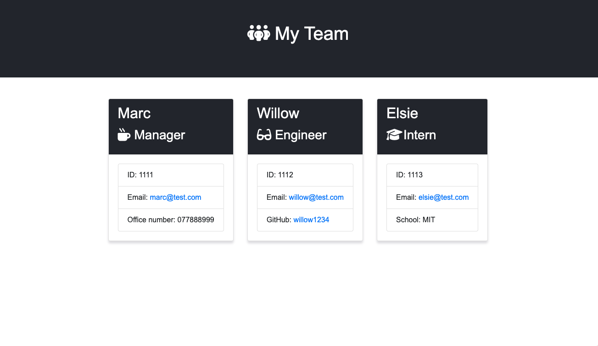

# Team Profile Generator


## The Task:

* I have been tasked with creating a command-line application. This application will take in information about employees on a software engineering team, then generates an HTML webpage that displays summaries for each person.

* This app features dynamically updated information.

<br>

**Table of Contents:**

* [Installation](#installation)
* [Usage](#usage)
* [Screenshots](#screenshots)
* [Credits](#credits)
* [License](#license)

<br>

**Instructions**

Create a command-line application that accepts accepts user input and outputs to HTML file.

* Manger Info
  - Name
  - Id
  - Email
  - Office Number

<br>

* Engineer:
  - Name
  - Id
  - Email
  - Github Username

  <br>

* Intern:
  - Name
  - Id
  - Email
  - School

<br>

## Installation

<br>

Run the `Team-Generator` application and follow the prompts. You (the manager) will first be prompted for your details before being asked to enter you employee details.

Once you have entered all of the details, the information given will be rendered to a html template file and a finished html file will be created in the output folder.

The application will be invoked by using the following command:

```bash
node index.js
```

<br>

# Usage

N/A

<br>

## Screenshots



<br>

## Credits

N/A

<br>

## License

* _This application has the MIT Licence_
For more info, please go to the [licence description](https://opensource.org/license/mit/)